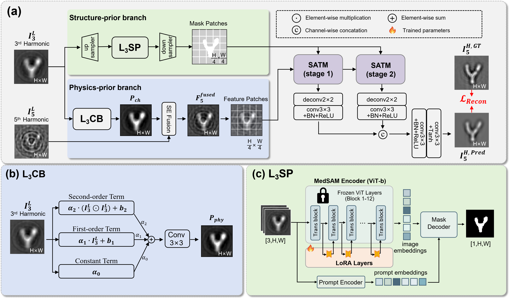
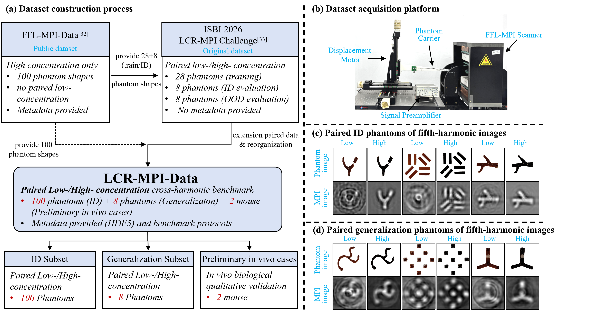

<div align="center">

# T4FNet

### Structure- and Physics-Prior Guided Low-Concentration MPI Reconstruction

<p>
  A reproducible PyTorch implementation for restoring high-quality fifth-harmonic
  magnetic particle imaging from paired low-concentration harmonic measurements.
</p>

[](https://www.python.org/)
[](https://pytorch.org/)
[](https://developer.nvidia.com/cuda-toolkit)
[](https://doi.org/10.5281/zenodo.22112372)
[](#data-preparation)

[Overview](#overview) · [Architecture](#architecture) · [Dataset](#dataset) · [Installation](#installation) · [Training](#training) · [Inference](#inference)

</div>

---

## Overview

T4FNet reconstructs a high-concentration fifth-harmonic MPI image from two low-concentration measurements. The model combines anatomical structure, harmonic physics, and global context in one reconstruction pipeline.

```text
Input  : [-L3, L5]  -> [B, 2, 64, 64]
Output : H5          -> [B, 1, 64, 64]
```

The main components are:

- **L3SP:** a MedSAM-LoRA structure-prior branch that produces spatial mask guidance.
- **L3CB:** a learnable Chebyshev bridge that maps third-harmonic information into fifth-harmonic features.
- **SE Fusion:** adaptive fusion of the measured and physics-mapped fifth-harmonic features.
- **SATM:** two soft-mask-guided Transformer stages for global reconstruction.
- **UNest-style decoder:** progressive feature fusion and image recovery at `64 × 64` resolution.

## Architecture

<div align="center">
  
  <br>
  <sub><b>Figure 1.</b> T4FNet architecture, including the full reconstruction pipeline, the L3CB physics-prior branch, and the MedSAM-LoRA L3SP structure-prior branch.</sub>
</div>

### Network configuration

| Component | Configuration |
|---|---|
| Input harmonics | Inverted third harmonic and fifth harmonic |
| Input resolution | `64 × 64` |
| Patch size | `4 × 4` |
| Token grid | `16 × 16` / 256 tokens |
| Embedding dimension | 256 |
| Attention heads | 4 |
| Transformer stages | 2 |
| Blocks per stage | 2 |
| MLP dimension | 512 |
| Decoder channels | 64 |
| Output activation | Sigmoid |
| Total parameters | 96,879,309 |
| Trainable reconstruction parameters | 2,977,114 |

### MedSAM-LoRA configuration

| Setting | Value |
|---|---|
| Backbone | MedSAM ViT-B |
| LoRA rank | 4 |
| LoRA alpha | 8 |
| LoRA dropout | 0.1 |
| Target module | `qkv` |
| Prompt | Automatically generated bounding box |
| T4FNet training | Complete mask generator frozen |

## Dataset

T4FNet is developed with **LCR-MPI-Data**, a paired low-/high-concentration cross-harmonic MPI benchmark. The public release contains ID data, cross-device generalization data, and preliminary in-vivo cases.

<div align="center">
  
  <br>
  <sub><b>Figure 2.</b> LCR-MPI-Data acquisition system, benchmark composition, and representative low-/high-concentration MPI pairs.</sub>
</div>

### Dataset composition

| Subset | Samples | Purpose | Reference available |
|---|---:|---|---|
| ID | 100 phantoms | Five-fold training, validation, and testing | Yes |
| ID-Augmented | 1,400 samples | Reproducible training augmentation | Yes |
| Generalization | 8 phantoms | Cross-device evaluation | Yes |
| InVivo | 2 mouse cases | Preliminary in-vivo inference | No |

Dataset: **[LCR-MPI-Data on Zenodo](https://doi.org/10.5281/zenodo.22112372)**

### Data preparation

The selected harmonic channels are resized from `49 × 49` to `64 × 64` using bilinear interpolation. Min-max normalization is applied independently to each resized image.

```text
input channel 0 = minmax(resize(-L3, 64 × 64))
input channel 1 = minmax(resize( L5, 64 × 64))
target          = minmax(resize( H5, 64 × 64))
```

Expected layout:

```text
LCR-MPI-Data/
├── ID/
├── ID-Augmented/
├── Generalization/
└── InVivo/
```

Only augmentations belonging to the current fold's training subjects are loaded, preventing validation and test leakage.

## Installation

### Conda

```bash
git clone https://github.com/BUAALGH/LCR-MPI-Data.git
cd LCR-MPI-Data/T4FNet-OpenSource

conda env create -f environment.yml
conda activate t4fnet
```

### Recorded environment

| Software | Version |
|---|---:|
| Python | 3.10.18 |
| PyTorch | 2.10.0 |
| CUDA | 12.8 |
| TorchVision | 0.25.0 |

Install a PyTorch build compatible with the local NVIDIA driver when reproducing the environment on another system.

## Checkpoints

Training requires:

1. the MedSAM ViT-B base checkpoint, `medsam_vit_b.pth`;
2. the MPI-tuned MedSAM-LoRA checkpoint, `best_model.pth`.

Download the base checkpoint from the [official MedSAM project](https://github.com/bowang-lab/MedSAM). See [`checkpoints/README.md`](checkpoints/README.md) for the expected files and distribution notes.

Set checkpoint paths in [`configs/t4fnet_v4_b.json`](configs/t4fnet_v4_b.json) or provide them through the command line.

## Training

### Reproduction settings

| Setting | Value |
|---|---:|
| Cross-validation | 5 folds |
| Split per fold | 65 train / 15 validation / 20 ID test |
| Samples per training fold | 975 with pre-generated augmentation |
| Random seed | 42 |
| Epochs | 100 |
| Total batch size | 8 |
| Optimizer | AdamW |
| Learning rate | `1e-4` |
| Weight decay | `1e-4` |
| AdamW betas / epsilon | PyTorch defaults |
| Scheduler | CosineAnnealingLR |
| `T_max` | 20 epochs |
| Minimum learning rate | `1e-7` |
| Scheduler update | Once per epoch |
| Loss | `0.5 × L1 + 0.5 × (1 − SSIM)` |
| Mixed precision | Enabled on CUDA |
| Checkpoint selection | Lowest validation loss |

Each fold starts from a newly initialized T4FNet model. The original protocol does not use early stopping.

### Train all folds

```bash
python train.py --config configs/t4fnet_v4_b.json
```

### Train one fold

```bash
python train.py --config configs/t4fnet_v4_b.json --fold 1
```

### Common overrides

```bash
# Disable mixed precision.
python train.py --config configs/t4fnet_v4_b.json --no-amp

# Train without the pre-generated augmented subset.
python train.py --config configs/t4fnet_v4_b.json --no-augmented
```

Outputs are saved under `outputs/` and include the resolved configuration, epoch history, latest checkpoint, best model, and evaluation summary.

## Inference

### Generalization subset

```bash
python infer.py \
  --subset generalization \
  --data-root /path/to/LCR-MPI-Data \
  --checkpoint /path/to/fold1/best_model.pth \
  --medsam-base-checkpoint /path/to/medsam_vit_b.pth
```

### In-vivo subset

```bash
python infer.py \
  --subset invivo \
  --data-root /path/to/LCR-MPI-Data \
  --checkpoint /path/to/fold1/best_model.pth \
  --medsam-base-checkpoint /path/to/medsam_vit_b.pth
```

Predictions are saved as `64 × 64` NumPy arrays in `predictions/`.

## Repository structure

```text
T4FNet-OpenSource/
├── configs/
│   └── t4fnet_v4_b.json
├── checkpoints/
│   └── README.md
├── scripts/
│   ├── train_5fold.sh
│   └── verify_checkpoint.py
├── t4fnet/
│   ├── data.py
│   ├── losses.py
│   ├── medsam_lora.py
│   ├── metrics.py
│   ├── model.py
│   ├── reproducibility.py
│   └── transformer.py
├── tests/
│   └── smoke_test.py
├── figure1.png
├── figure3.png
├── infer.py
├── train.py
├── environment.yml
└── requirements.txt
```

## Verification

Run the lightweight architecture test:

```bash
python tests/smoke_test.py
```

Check compatibility with a complete T4FNet checkpoint:

```bash
python scripts/verify_checkpoint.py \
  --checkpoint /path/to/best_model.pth \
  --medsam-base-checkpoint /path/to/medsam_vit_b.pth
```

The cleaned implementation has been verified against the original research code with the same input and trained checkpoint. The outputs are element-wise identical.

## Citation

Citation information will be added after publication. If you use the dataset, please cite the DOI-linked LCR-MPI-Data release.

---

<div align="center">
  <sub>Built for reproducible low-concentration magnetic particle imaging research.</sub>
</div>
